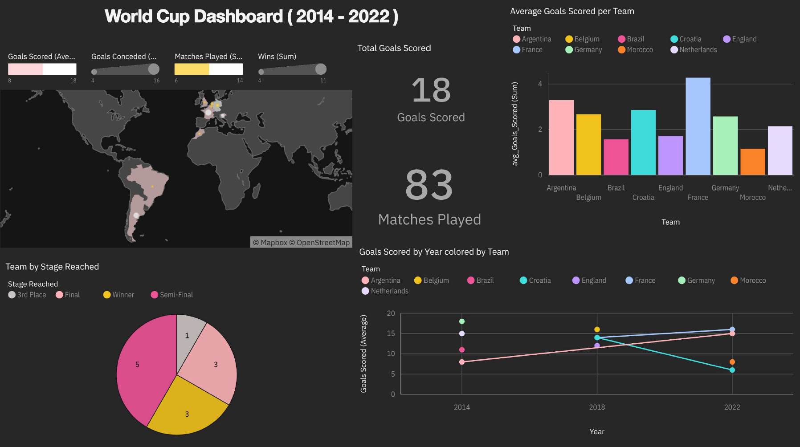

# FIFA World Cup Data Dashboard

This project visualizes key statistics from historical FIFA World Cup tournaments using IBM Cognos Analytics.

## What the dashboard shows:
- Top goal-scoring teams  
- Tournament winners  
- Teams with the most matches played  
- Geographical visualization of participating countries  
- Performance trends over time  

## Tools Used:
- IBM Cognos Analytics  
- Microsoft Excel (for data preparation)

## Dataset:
The dataset used in this dashboard is available in this repository: [world cup 2014-2022.xlsx](./world%20cup%202014-2022.xlsx)

It includes World Cup statistics from 2014 to 2022, prepared and cleaned manually from public sources.

## Dashboard Preview:

## Notes:
This is my first data project using IBM Cognos Analytics.  
It focuses on presenting clear KPIs, interactive elements, and visual storytelling to analyze World Cup history.
